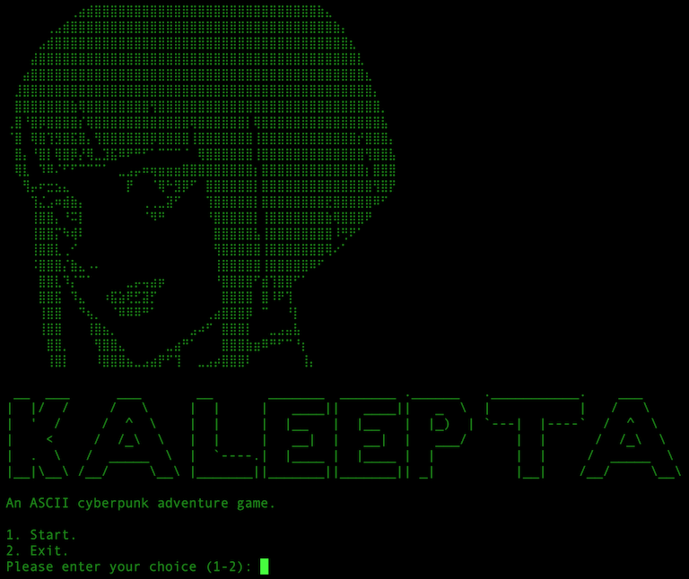

# Kaleepta: An ASCII Adventure Game

Delve into a text-based adventure right from your terminal with "Kaleepta", a game developed in the C language.



## Requirements

Ensure you have the `gcc` compiler installed, as it's essential to build the game.

## Running the Game

After installation, navigate to the game directory and execute the following command:

```bash
./launch.sh
```
